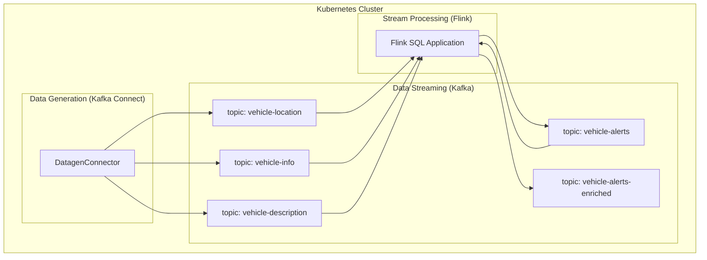

# 🚚 Real-Time Fleet Monitoring with Confluent Platform 8.0 and CP Flink

This project demonstrates a complete, real-time data pipeline built on the **Confluent Platform** to ingest and manage data streams, and **CP Flink** to process, analyze, and enrich that data in real-time.

- [🚚 Real-Time Fleet Monitoring with Confluent Platform 8.0 and CP Flink](#-real-time-fleet-monitoring-with-confluent-platform-80-and-cp-flink)
  - [Disclaimer](#disclaimer)
  - [What You'll Build](#what-youll-build)
  - [Architecture](#architecture)
- [Setup](#setup)
  - [ Prerequisites](#prerequisites)
  - [1. Deploy Kubernetes](#1-deploy-kubernetes)
  - [2. Start Confluent Platform](#2-start-confluent-platform)
    - [Deploy the Operator](#deploy-the-operator)
    - [Configure Security (mTLS)](#configure-security-mtls)
    - [Deploy Confluent Components](#deploy-confluent-components)
    - [Access Control Center](#access-control-center)
  - [3. Feed test data](#3-feed-test-data)
    - [Create Topics](#create-topics)
    - [Start the Datagen Connector](#start-the-datagen-connector)
  - [4. Install CP Flink](#4-install-cp-flink)
    - [Install Prerequities](#install-prerequities)
    - [Install Operators](#install-operators)
    - [Deploy CMF REST Class](#deploy-cmf-rest-class)
  - [5. Process the data with Flink](#5-process-the-data-with-flink)
    - [Build the Application Image](#build-the-application-image)
    - [Deploy the Flink Application](#deploy-the-flink-application)
  - [6. Cleanup](#6-cleanup)

## Disclaimer

> The code and instructions provided here are **NOT** intended for production use. They are meant to serve as an example and do not replace the official documentation of the referenced products.

## What You'll Build

You will create an end-to-end streaming application that simulates a fleet management system. The pipeline will:

1.  **Generate** mock vehicle data (location, engine stats, and descriptions) using Kafka Connect.
2.  **Ingest** this data into multiple Kafka topics.
3.  **Process** the streams with a Flink SQL application to:
    * Calculate the real-time speed of each vehicle.
    * Detect alert-worthy conditions (e.g., speeding, overheating).
    * Enrich alerts with descriptive data (driver name, vehicle brand) using a stream-table join.
4.  **Publish** the final, enriched alerts to a new Kafka topic for consumption by downstream applications (like dashboards or other services).

## Architecture

The entire system runs on Kubernetes and is managed by operators. The data flows from the Datagen source, through Kafka, is processed by Flink, and finally lands in the enriched topic.



# Setup

The following section details a step by step procedure to make the demo work locally. You can safely copy and paste the commands and it should work seamlessly.

##  Prerequisites

> To run this demo, you'll need a working local environment with kind, helm, kubectl, openssl, and maven.

## 1. Deploy Kubernetes

First, create a local Kubernetes cluster using `kind`.

```shell
kind create cluster --image kindest/node:v1.31.0
```

<details>
<summary><b>Optional: Deploy the Kubernetes Dashboard</b></summary>

If you want to use the web-based Kubernetes dashboard, run these commands in a separate terminal.

```shell
kubectl apply -f https://raw.githubusercontent.com/kubernetes/dashboard/v2.7.0/aio/deploy/recommended.yaml --context kind-kind
kubectl create serviceaccount -n kubernetes-dashboard admin-user
kubectl create clusterrolebinding -n kubernetes-dashboard admin-user --clusterrole cluster-admin --serviceaccount=kubernetes-dashboard:admin-user
token=$(kubectl -n kubernetes-dashboard create token admin-user)
echo $token
kubectl proxy
```

Copy the token displayed on output and use it to login at http://localhost:8001/api/v1/namespaces/kubernetes-dashboard/services/https:kubernetes-dashboard:/proxy/#/login

You may need to wait a couple of seconds for dashboard to become available.

</details>

## 2. Start Confluent Platform

Now, let's deploy the core Confluent Platform components using the official Helm chart and Confluent for Kubernetes (CFK) Operator.

### Deploy the Operator

First, create a `confluent` namespace and install the CFK operator.

```shell
kubectl create namespace confluent
kubectl config set-context --current --namespace=confluent
helm repo add confluentinc https://packages.confluent.io/helm
helm repo update
helm upgrade --install operator confluentinc/confluent-for-kubernetes
```

🔍 **Check Status:** Wait for the operator pod to be in a `Running` state.
```shell
watch kubectl get pods
```

### Configure Security (mTLS)
The different components inthe demo will use mTLS, so we have to create certificates and Kubernetes secrets with them.

```shell
# Generate all the necessary TLS certificates
./generate_certificates.sh

# Create Kubernetes secrets from the generated certificates
./create_secrets.sh
```

### Deploy Confluent Components

Apply the `infra.yaml` manifest to deploy the entire Confluent Platform. This will spin up the following components:

| Component         | Version | Replicas | Notes                                |
| ----------------- | ------- | -------- | ------------------------------------ |
| kRaft Controller  | 8.0.0   | 1        | Manages the Kafka cluster (no ZK)    |
| Kafka Broker      | 8.0.0   | 3        | The core streaming platform          |
| Schema Registry   | 8.0.0   | 1        | Manages Avro schemas                 |
| Kafka Connect     | 8.0.0   | 1        | For data integration (our data source) |
| REST Proxy        | 8.0.0   | 1        | HTTP access to Kafka                 |
| Control Center    | 2.2.0   | 1        | The web-based management UI          |

```shell
kubectl apply -f cp/infra.yaml
```

🔍 **Check Status:** This will take a few minutes. Wait until all pods are `Running` and have a `READY` status like `1/1`.
```shell
watch kubectl -n confluent get pods
```

### Access Control Center

Once all the pods are up and running, you can create a port-forward to be able to access the Control Center:

```shell
kubectl -n confluent port-forward controlcenter-ng-0 9021:9021 > /dev/null 2>&1 &
```

> **Note:** As HTTPS access is based on the certificates generated at the beginning of the demo, the url to access the Control Center has to match the SAN included in the certificate. In order to be able to reach the Control Center using https://controlcenter-ng.confluent.svc.cluster.local:9021/, you will probably need to include the line
> ```
> 127.0.0.1     controlcenter-ng.confluent.svc.cluster.local
> ```
in you "/etc/hosts" file.

Once all the pods are up and running, and you have forwarded the port, you can access the Control Center here: https://controlcenter-ng.confluent.svc.cluster.local:9021/

✅ You can now access Confluent Control Center at: **https://controlcenter-ng.confluent.svc.cluster.local:9021/**

---

## 3. Feed test data

With the platform running, let's create our topics and start generating mock data.

### Create Topics

```shell
kubectl apply -f data/topics.yaml
```

### Start the Datagen Connector

For the demo, we will use the DatagenConnector in the Connect cluster to generate mock data. In this case the generated data will simulate a fleet of 150 trucks. Run:

```shell
kubectl apply -f data/data_source.yaml
```

🔍 **Check Status:** You can go to Control Center to see the data flowing into the following topics:
* `vehicle-description`: A master table with vehicle details (brand, driver, etc.).
* `vehicle-location`: A continuous stream of vehicle coordinates.
* `vehicle-info`: A continuous stream of engine temperature and RPM readings.

> **Note:** The `vehicle-description` connector will generate its 151 messages and then stop, entering a `Failed` state. This is expected behavior as its job is just to populate the "master table" once.


## 4. Install CP Flink

Now, let's deploy the Flink on Kubernetes operator and Confluent Manager for Apache Flink (CMF).

### Install Prerequities

```shell
# Install certificate manager, a requirement for the Flink Operator:

kubectl create -f https://github.com/jetstack/cert-manager/releases/download/v1.8.2/cert-manager.yaml

# Wait until an endpoint IP is assigned when executing the following:

watch kubectl get endpoints -n cert-manager cert-manager-webhook
```

### Install Operators

Install the Flink Kubernetes Operator:

```shell
kubectl config set-context --current --namespace=confluent
helm upgrade --install cp-flink-kubernetes-operator --version "~1.120.0" confluentinc/flink-kubernetes-operator --set watchNamespaces="{confluent}"
```

With the Operator deployed, now we can deploy Confluent Manager for Apache Flink. It will also have mTLS configured in the file mtls-cmf.yaml, and encryption keys defined, as needed for production use. In case cmf.sql.production=false is defined, no encryption keys are required.

```shell
openssl rand -out ./certs/cmf.key 32
kubectl create secret generic cmf-encryption-key --from-file=encryption-key=./certs/cmf.key -n confluent

helm upgrade --install -f cp/mtls-cmf.yaml cmf confluentinc/confluent-manager-for-apache-flink \
    --set cmf.logging.level.root=debug \
    --set cmf.sql.production=true \
    --set encryption.key.kubernetesSecretName=cmf-encryption-key \
    --set encryption.key.kubernetesSecretProperty=encryption-key \
    --namespace confluent
```

Wait until the CMF operator pod is Running and ready:

```shell
watch kubectl -n confluent get pods
```

And then, forward the port:
```shell
kubectl port-forward service/cmf-service 8080:80 -n confluent > /dev/null 2>&1 &
```

### Deploy CMF REST Class

And deploy CMFRestClass, to allow defining FlinkEnvironments and FlinkApplications with CfK:

```shell
kubectl apply -f cp/cmf-rest-class.yaml
```

🔍 **Check Status:** You can verify that the `cmfrestclass` was created successfully.
```shell
kubectl get cmfrestclass cmfrestclass -n confluent -oyaml
```

---

## 5. Process the data with Flink

With the full environment ready, it's time to deploy and run our Flink SQL job.

### Build the Application Image

We will be leveraging the standard `flink-sql-runner-example` (https://github.com/apache/flink-kubernetes-operator/tree/main/examples/flink-sql-runner-example).

Compile, build the docker image and load in kind (it may take a bit to load cause the flink image is not so small):

```shell
cd flink-sql/flink-sql-runner-example
mvn clean verify
DOCKER_BUILDKIT=1 docker build . -t flink-sql-runner-example:latest
kind load docker-image flink-sql-runner-example:latest
cd ../..
```

### Deploy the Flink Application

The Flink application is defined declaratively. It will perform the following steps:

1.  Calculates the real-time speed of each truck based on its location data.
2.  Generates an alert if a truck exceeds a threshold for speed (>120 km/h), engine temperature (>210°C), or RPMs (>7500).
3.  Enriches these alerts by joining them with the `vehicle-description` table to add the driver's name, vehicle brand, and license plate.
4.  Writes the final, enriched alerts to the `vehicle-alerts-enriched` topic.

And now create our CP Flink environment:

```shell
# First, create the Flink Environment

kubectl apply -f flink/flink-environment.yaml

# Then, deploy the application
kubectl apply -f flink/flink-application.yaml
```

🔍 **Check Status:** Wait for the Flink JobManager and TaskManager pods to start.
---shell
watch kubectl get pods

✅ **Done!** Your end-to-end pipeline is now running. You can explore the final `vehicle-alerts-enriched` topic in Control Center to see the processed data, and view the Flink job's metrics in the "Apache Flink Dashboard" within Control Center.

---

## 6. Cleanup

To completely remove the Kubernetes cluster and all its resources, simply run:

```shell
kind delete cluster
```
