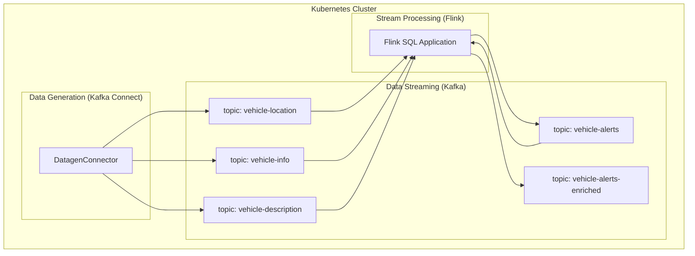

# 🚚 Real-Time Fleet Monitoring with CP Flink and Confluent

This project demonstrates a complete, real-time data pipeline built on Kubernetes. It uses the **Confluent Platform** to ingest and manage data streams, and **Apache Flink** to process, analyze, and enrich that data in real-time.

- [🚚 Real-Time Fleet Monitoring with CP Flink and Confluent](#-real-time-fleet-monitoring-with-cp-flink-and-confluent)
  - [Disclaimer](#disclaimer)
  - [What You'll Build](#what-youll-build)
  - [Architecture](#architecture)
- [Setup](#setup)
  - [Deploy Kubernetes](#deploy-kubernetes)
  - [Start Confluent Platform](#start-confluent-platform)
  - [Feed test data](#feed-test-data)
  - [Install CP Flink](#install-cp-flink)
  - [Process the data with Flink](#process-the-data-with-flink)
  - [Cleanup](#cleanup)

## Disclaimer

> The code and instructions provided here are **NOT** intended for production use. They are meant to serve as an example and do not replace the official documentation of the referenced products.

## What You'll Build

You will create an end-to-end streaming application that simulates a fleet management system. The pipeline will:

1.  **Generate** mock vehicle data (location, engine stats, and descriptions) using Kafka Connect.
2.  **Ingest** this data into multiple Kafka topics.
3.  **Process** the streams with a Flink SQL application to:
    * Calculate the real-time speed of each vehicle.
    * Detect alert-worthy conditions (e.g., speeding, overheating).
    * Enrich alerts with descriptive data (driver name, vehicle brand) using a stream-table join.
4.  **Publish** the final, enriched alerts to a new Kafka topic for consumption by downstream applications (like dashboards or other services).

## Architecture

The entire system runs on Kubernetes and is managed by operators. The data flows from the Datagen source, through Kafka, is processed by Flink, and finally lands in the enriched topic.



# Setup

## Prerequisites

> To run this demo, you'll need a working local environment with kind, helm, kubectl, openssl, and maven.

## Deploy Kubernetes

First, create a local Kubernetes cluster using `kind`.

```shell
kind create cluster --image kindest/node:v1.31.0
```

<details>
<summary><b>Optional: Deploy the Kubernetes Dashboard</b></summary>

If you want to use the web-based Kubernetes dashboard, run these commands in a separate terminal.

```shell
kubectl apply -f https://raw.githubusercontent.com/kubernetes/dashboard/v2.7.0/aio/deploy/recommended.yaml --context kind-kind
kubectl create serviceaccount -n kubernetes-dashboard admin-user
kubectl create clusterrolebinding -n kubernetes-dashboard admin-user --clusterrole cluster-admin --serviceaccount=kubernetes-dashboard:admin-user
token=$(kubectl -n kubernetes-dashboard create token admin-user)
echo $token
kubectl proxy
```

Copy the token displayed on output and use it to login at http://localhost:8001/api/v1/namespaces/kubernetes-dashboard/services/https:kubernetes-dashboard:/proxy/#/login

You may need to wait a couple of seconds for dashboard to become available.

</details>

## Start Confluent Platform

In your running kubernetes cluster, create now a namespace for the demo, called "confluent" and deploy Confluent's operator:

```shell
kubectl create namespace confluent
kubectl config set-context --current --namespace=confluent
helm repo add confluentinc https://packages.confluent.io/helm
helm repo update
helm upgrade --install operator confluentinc/confluent-for-kubernetes
```

Check pod is ready:

```shell
watch kubectl get pods
```

The different components inthe demo will use mTLS, so we have to create certificates and Kubernetes secrets with them. Generate the certificates for all the components in the demo:

```shell
./generate_certificates.sh
```

And now create the corresponding Kubernetes secrets with those certificates:

```shell
./create_secrets.sh
````

Everything is now ready to spin up the CP components. The environment will have:

- 1 kRaft controller v8.0.0
- 3 kafka brokers v8.0.0
- 1 Schema Registry v8.0.0
- 1 Connect worker v8.0.0
- 1 Rest Proxy v8.0.0
- 1 instance of the new Control Center v2.2.0

```shell
kubectl apply -f cp/infra.yaml
```

It will take a while to start all the pieces, you can check the process with the following command:

```shell
watch kubectl -n confluent get pods
```

Once all the pods are up and running, you can create a port-forward to be able to access the Control Center:

```shell
kubectl -n confluent port-forward controlcenter-ng-0 9021:9021 > /dev/null 2>&1 &
```

As HTTPS access is based on the certificates generated at the beginning of the demo, the url to access the Control Center has to match the SAN included in the certificate. In order to be able to reach the Control Center using https://controlcenter-ng.confluent.svc.cluster.local:9021/, you will probably need to include the line

127.0.0.1	    controlcenter-ng.confluent.svc.cluster.local

in you "/etc/hosts" file.

Once all the pods are up and running, and you have forwarded the port, you can access the Control Center here: https://controlcenter-ng.confluent.svc.cluster.local:9021/

At this point you have a working Kafka environment, but Flink is still not vailable (you will see error messages referring to this in the Control Center).

## Feed test data

First of all, create the necessary topics, with:

```shell
kubectl apply -f data/topics.yaml
```

For the test, we will use the DatagenConnector in the Connect cluster to generate mock data. In this case the generated data will resemble fleet data of a transports company. Run:

```shell
kubectl apply -f data/data_source.yaml
```

You should be able to see the data flowing into the created topics. The mock data will generate data for 150 trucks, simulating their locations and some engine temperature and RPM alerts like this:

- vehicle-location: Messages will associate a vehicle_id to a latitude/longitude and a point in time.
- vehicle-info: Messages will associate a vehicle_id to an engine temperature, average RPM and a point in time.
- vehicle-description: Master table with all the vehicle_ids and their brand, license plate and name of the driver.

The vehicle-description generates a small number of messages and it is normal that once it has generated the contents of the master table (151 messages) it will remain in Failed mode.


## Install CP Flink

Let's complete the set up now deploying all the necessary pieces to have a Flink environment.

Install certificate manager:

```shell
kubectl create -f https://github.com/jetstack/cert-manager/releases/download/v1.8.2/cert-manager.yaml
```

Wait until an endpoint IP is assigned when executing the following:

```shell
watch kubectl get endpoints -n cert-manager cert-manager-webhook
```

Now install the Flink Kubernetes Operator:

```shell
kubectl config set-context --current --namespace=confluent
helm upgrade --install cp-flink-kubernetes-operator --version "~1.120.0" confluentinc/flink-kubernetes-operator --set watchNamespaces="{confluent}"
```

With the Operator deployed, now we can deploy Confluent Manager for Apache Flink.It will also have mTLS configured in the file mtls-cmf.yaml, and encryption keys defined, as needed for production use. In case cmf.sql.production=false is defined, no encryption keys are required.

```shell
openssl rand -out ./certs/cmf.key 32
kubectl create secret generic cmf-encryption-key --from-file=encryption-key=./certs/cmf.key -n confluent

helm upgrade --install -f cp/mtls-cmf.yaml cmf confluentinc/confluent-manager-for-apache-flink \
    --set cmf.logging.level.root=debug \
    --set cmf.sql.production=true \
    --set encryption.key.kubernetesSecretName=cmf-encryption-key \
    --set encryption.key.kubernetesSecretProperty=encryption-key \
    --namespace confluent
```

Wait until the CMF operator pod is Running and ready:

```shell
watch kubectl -n confluent get pods
```

And then, forward the port:
```shell
kubectl port-forward service/cmf-service 8080:80 -n confluent > /dev/null 2>&1 &
```

And deploy CMFRestClass, to allow defining FlinkEnvironments and FlinkApplications with CfK:

```shell
kubectl apply -f cp/cmf-rest-class.yaml
```

And check it has been successfully deployed checking:

```shell
kubectl get cmfrestclass cmfrestclass -n confluent -oyaml
```

It may take some seconds, but you should see one instance called "cmfrestclass" and no errors.

## Process the data with Flink

At this point, the environment is ready and we can start deploying Flink Environment and applications. We will deploy the FlinkEnvironment and FlinkApplication declaratively, by using the corresponding Yaml files.

We will be leveraging the standard `flink-sql-runner-example` (https://github.com/apache/flink-kubernetes-operator/tree/main/examples/flink-sql-runner-example).

Compile, build the docker image and load in kind (it may take a bit to load cause the flink image is not so small):

```shell
cd flink-sql/flink-sql-runner-example
mvn clean verify
DOCKER_BUILDKIT=1 docker build . -t flink-sql-runner-example:latest
kind load docker-image flink-sql-runner-example:latest
cd ../..
```

And now create our CP Flink environment:

```shell
kubectl apply -f flink/flink-environment.yaml
```

And after our application:

```shell
kubectl apply -f flink/flink-application.yaml
```

Check pods are ready (1 job manager and 3 task managers):

```shell
watch kubectl get pods
```

The application does several steps:

- First of all, processes the vehicle-locations topic to calculate the average speed that a truck needed to move from one point to the next. As locaitons are random, the speed values may not be very realistic. These values are published into the vehicle-speed topic.

- Then, a topic vehicle-alerts is filled with the vehicle_ids and point in time when a certain truck exceeded 210 degrees, 7500 rpm or 120 kmh. These thresholds have been chose randomly just for the demo.

- Finally, those alerts are enriched with the brand, license plate and name of the driver coming from the vehicle-description master table and written to the vehicle-alerts-enriched topic.

You can check the status and the metrics of the Flink Application just by clicking on the "Apache Flink Dashboard" button integrated in the FlinkApplication page of the Control Center.

## Cleanup

You can clean all the environment just by running

```shell
kind delete cluster
```
